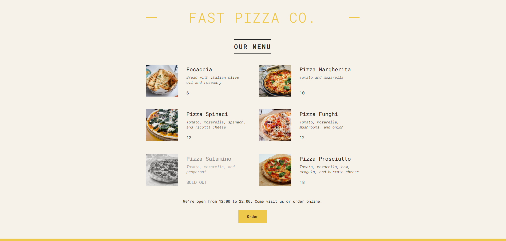

# Fast Pizza Menu

Fast Pizza Menu is a responsive web application built with React that provides users with an engaging menu to explore and order from a variety of delicious pizzas. The app dynamically displays the menu based on real-time data, handles out-of-stock items gracefully, and adapts its footer messaging based on the time of day.

## Features

- **Dynamic Menu:** Displays a list of pizzas with their details, such as name, ingredients, price, and availability.
- **Real-Time Availability:** Marks pizzas as "SOLD OUT" when unavailable.
- **Responsive Design:** Provides a seamless user experience across devices.
- **Dynamic Footer:** Displays opening and closing hours based on the current time.
- **Reusable Components:** Modular structure with reusable React components for scalability.

## Component Tree

```
App
├── Header
├── Menu
│   ├── Pizza
├── Footer
│   └── Order
```

## Screenshot 


## Tech Stack

- **Frontend:** React, CSS
- **Module Bundler:** Vite/Webpack (depending on your setup)
- **Styling:** Custom CSS with responsive design principles

## Installation

1. Clone the repository:
   ```bash
   https://github.com/TarkhanGurbanli/Fast-Pizza-Menu.git
   ```
2. Navigate to the project directory:
   ```bash
   cd fast-pizza-menu
   ```
3. Install dependencies:
   ```bash
   npm install
   ```
4. Start the development server:
   ```bash
   npm start
   ```
5. Open your browser and go to `http://localhost:3000`.

## Folder Structure

```
fast-pizza-menu
├── public
│   └── pizzas
│       ├── focaccia.jpg
│       ├── margherita.jpg
│       ├── spinaci.jpg
│       ├── funghi.jpg
│       ├── salamino.jpg
│       └── prosciutto.jpg
├── src
│   ├── components
│   │   ├── Header.jsx
│   │   ├── Menu.jsx
│   │   ├── Pizza.jsx
│   │   ├── Footer.jsx
│   │   └── Order.jsx
│   ├── data
│   │   └── pizzaData.js
│   ├── App.jsx
│   └── index.css
├── .gitignore
├── package.json
├── README.md
└── index.html
```

## Usage

1. Launch the application using the installation steps.
2. Browse the menu to explore available pizzas.
3. Check the dynamic footer for real-time updates on opening hours.

## License

This project is licensed under the MIT License. See the `LICENSE` file for details.

## Contact
If you have any questions or suggestions about this project, feel free to reach out:
- **GitHub**: [TarkhanGurbanli](https://github.com/TarkhanGurbanli)
- **Linkedin**: [TarkhanGurbanli](https://www.linkedin.com/in/tarkhan-gurbanli/)

## Contributing

Contributions are welcome! If you'd like to contribute, please fork the repository and create a pull request.

---

Enjoy using Fast Pizza Menu! 🍕
